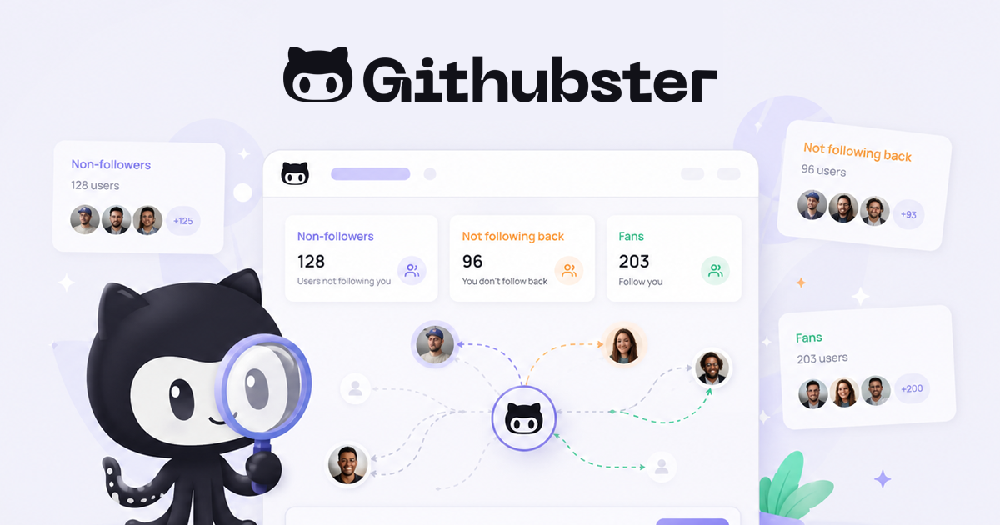

# Githubster



Track your GitHub followers, unfollowers and following relationships.

   

Githubster is a free, open-source tool that helps you understand your public GitHub social graph. It requests profile data directly from the GitHub API in your browser, without requiring a Githubster account.

## Features

- **Not Following Back** — people you follow who don't follow you back
- **You Don't Follow Back** — people who follow you but you don't follow back
- **Mutuals** — people you follow who also follow you
- **Following** — everyone you follow
- **Followers** — everyone who follows you
- **Profile Overview** — top languages, total stars, repositories
- Sort users by name (A→Z, Z→A)
- Search and filter within each tab
- Share profile link with one click
- Keyboard shortcut (`/`) to focus search
- Loading progress with skeleton animation
- Optional GitHub token for higher rate limits
- Dark/Light theme
- 17 languages supported (i18n with RTL)
- Web app manifest for standalone installation (GitHub data still requires a network connection)
- Browser-based profile analysis — usernames and optional tokens are sent directly to GitHub, not to a Githubster API
- SEO optimized with structured data (JSON-LD)

## Getting Started

```bash
# Install dependencies
npm install

# Run development server
npm run dev
```

Open [http://localhost:3000](http://localhost:3000) in your browser.

## GitHub Token (Optional)

Without a token, GitHub normally allows 60 REST API requests per hour per IP address. An authenticated personal account normally gets 5,000 requests per hour, but GitHub can apply different limits in some situations.

To create a token:

1. Open [GitHub Settings → Developer settings → Fine-grained tokens](https://github.com/settings/personal-access-tokens/new).
2. Create a fine-grained token with an expiration date and grant only the minimum access GitHub requires for the public endpoints you use.
3. Paste it into the optional token field. The value stays in the current page state, is used only for direct requests to `api.github.com`, and is cleared when the page is reloaded or closed.

GitHub recommends fine-grained tokens, limited permissions, and expiration dates. See [Keeping your API credentials secure](https://docs.github.com/en/rest/authentication/keeping-your-api-credentials-secure) and [permissions required for fine-grained tokens](https://docs.github.com/en/rest/authentication/permissions-required-for-fine-grained-personal-access-tokens).

## Tech Stack

- [Next.js 16](https://nextjs.org/) — React framework with Turbopack
- [React 19](https://react.dev/) — UI library
- [TypeScript 6](https://www.typescriptlang.org/) — type safety
- [Tailwind CSS 4](https://tailwindcss.com/) — utility-first styling
- [@tanstack/react-virtual](https://tanstack.com/virtual) — virtualized lists for large datasets
- [GitHub REST API](https://docs.github.com/en/rest) — data source

## Security

- Content Security Policy (CSP) headers
- Strict-Transport-Security (HSTS)
- X-Content-Type-Options, X-Frame-Options
- Permissions-Policy
- Profile analysis runs in the browser; Githubster does not persist usernames, GitHub responses, or optional tokens
- The optional token is a masked password field and can be revealed or cleared explicitly
- If Umami is configured, the site loads the configured analytics script; Githubster does not send GitHub tokens to it
- IndexNow submission requires a separate server-side bearer secret

## Environment variables

Copy `.env.example` to `.env.local` and set only the integrations you use.

| Variable | Purpose |
| --- | --- |
| `INDEXNOW_KEY` | Public IndexNow verification key, also served at `/{INDEXNOW_KEY}.txt` |
| `INDEXNOW_SECRET` | Private bearer secret required by `POST /api/indexnow`; use a random value of at least 32 characters, different from the public key |
| `NEXT_PUBLIC_UMAMI_WEBSITE_ID` | Optional Umami website identifier |
| `NEXT_PUBLIC_UMAMI_URL` | Optional analytics script URL |

Trigger IndexNow from a trusted deployment workflow or server environment:

```bash
curl --request POST https://www.githubster.com/api/indexnow \
  --header "Authorization: Bearer $INDEXNOW_SECRET"
```

`GET /api/indexnow` is intentionally unsupported, and the secret must never use a `NEXT_PUBLIC_` prefix.

## Contributing

1. Fork the repository
2. Create a feature branch (`git checkout -b feature/my-feature`)
3. Commit your changes (`git commit -am 'Add my feature'`)
4. Push to the branch (`git push origin feature/my-feature`)
5. Open a Pull Request

## License

MIT
